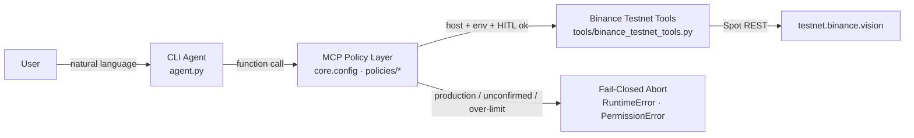
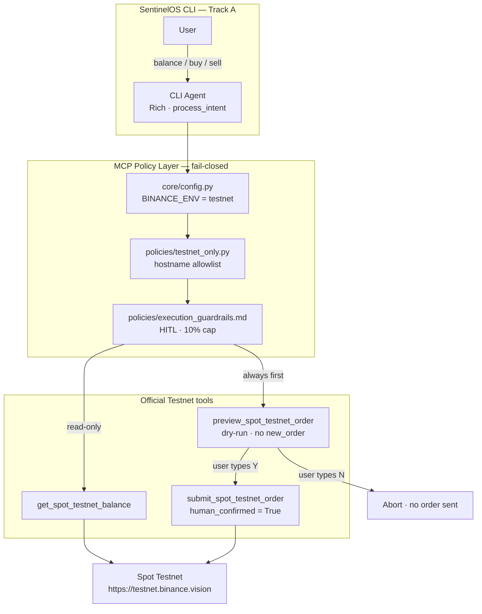

# SentinelOS

### Autonomous Risk-Defense & Volatility Guardian

**A fail-closed AI trading agent for Binance Agent OS.** SentinelOS observes Spot Testnet state, previews every order, and refuses to execute unless a human confirms. Production Binance hosts are unreachable by design.

> **100% Agent OS safety compliance.** Testnet-only enforcement. Fail-closed security. Human-in-the-loop confirmation. No production API path exists in this repository.

[](https://developers.binance.com/en/docs/agent-native/overview)
[](https://testnet.binance.vision)
[](#core-features)
[](#usage-guide)
[](https://agent.binance.com/mcp/agentic)

---

## Hackathon Track

**Track A: Build an AI agent with Agent OS**

SentinelOS is built for the Binance Agent OS Hackathon, Track A. It is a conversational CLI agent that speaks Agent OS natively:

| Official surface | How SentinelOS uses it |
| --- | --- |
| [Agent Native / MCP Overview](https://developers.binance.com/en/docs/agent-native/overview) | Architecture and discovery model |
| [llms.txt](https://developers.binance.com/en/docs/llms.txt) / [llms-full.txt](https://developers.binance.com/en/docs/llms-full.txt) | Machine-readable API context for agent reasoning |
| [Official MCP endpoint](https://agent.binance.com/mcp/agentic) | Advanced capability discovery (`https://agent.binance.com/mcp/agentic`) |
| [Binance Skills Hub](https://github.com/binance/binance-skills-hub) | Skill format — see [`skills/binance/SKILL.md`](skills/binance/SKILL.md) |
| [`binance-connector`](https://binance-connector.readthedocs.io/en/stable/getting_started.html) | Official Python Spot client, pinned to Testnet |

Spot trading intents never leave the local tool module. The skill definition routes every balance, preview, and submit call through [`tools/binance_testnet_tools.py`](tools/binance_testnet_tools.py).

---

## Core Features

SentinelOS is a **risk-defense agent**, not an autopilot. The default path is observe and recommend. Execution is a privilege the human grants per order.

### Testnet-only enforcement

- `BINANCE_ENV` **must** equal `testnet`. Any other value raises `RuntimeError` at boot.
- Spot base URL is pinned to `https://testnet.binance.vision`.
- Futures base URL is pinned to `https://testnet.binancefuture.com`.
- [`policies/testnet_only.py`](policies/testnet_only.py) parses every client hostname with `urllib.parse`. Hosts outside `{testnet.binance.vision, testnet.binancefuture.com}` raise:

```text
RuntimeError: Blocked non-Testnet Binance host.
```

- `api.binance.com`, `fapi.binance.com`, and sibling production hosts are rejected before a socket is opened.

### Fail-closed security

- Missing credentials, an unverified host, or a poisoned client **abort the flow**. There is no fallback to production.
- Settings are frozen Pydantic v2 models. Base URLs cannot be mutated after load.
- API keys are `SecretStr`. They are never printed in the CLI.
- Preview JSON that is not `{ "environment": "testnet", "status": "order_preview" }` cannot proceed to submit.
- Connector faults, policy blocks, and config errors surface as Rich **warnings**, not silent retries against another host.

### Human-in-the-loop confirmations

- `preview_spot_testnet_order` is a **dry-run mock**. It does not call `new_order`.
- `submit_spot_testnet_order(..., human_confirmed=False)` — the default — raises `PermissionError` and sends **nothing**.
- The CLI asks `Y/N` after every preview. **Only `Y` submits.** `N`, empty input, and any other string are denial.
- Maximum exposure: **10% of Testnet portfolio per trade**, enforced in code even after a `Y`.

### Agent OS / MCP compliance

- Skills Hub frontmatter and system instructions in [`skills/binance/SKILL.md`](skills/binance/SKILL.md).
- Function-calling tool surface: balance, preview, submit.
- Official MCP used for **capability discovery only** — never as a bypass around local guardrails.
- Guardrail policy documented in [`policies/execution_guardrails.md`](policies/execution_guardrails.md).

---

## Architecture Diagram

Every utterance travels the same path. The policy layer sits **in front of** Binance. Tools cannot be reached if Testnet checks fail.





| Layer | Path | Responsibility |
| --- | --- | --- |
| CLI Agent | [`agent.py`](agent.py) | Conversational loop, Rich UI, intent → tool routing |
| Config | [`core/config.py`](core/config.py) | Pydantic settings, frozen Testnet URLs, secret keys |
| Policy | [`policies/`](policies/) | Host allowlist, HITL, 10% exposure |
| Skill | [`skills/binance/SKILL.md`](skills/binance/SKILL.md) | Agent OS instructions and MCP/llms.txt routing |
| Tools | [`tools/binance_testnet_tools.py`](tools/binance_testnet_tools.py) | Official `binance-connector` Spot Testnet adapters |

---

## Installation Guide

Python 3.10+ is required. Run all commands from the repository root (`sentinel_os/`).

### 1. Create and activate a virtual environment

**Windows PowerShell**

```powershell
python -m venv .venv
.\.venv\Scripts\Activate.ps1
```

**macOS / Linux**

```bash
python -m venv .venv
source .venv/bin/activate
```

### 2. Install dependencies

```bash
pip install -r requirements.txt
```

This installs `binance-connector`, `pydantic>=2.0`, `pydantic-settings`, `python-dotenv`, `rich`, `aiohttp`, and `httpx`.

### 3. Configure Testnet credentials

```powershell
copy .env.example .env
```

```bash
cp .env.example .env
```

Edit `.env` and replace the placeholders with keys from [Spot Test Network](https://testnet.binance.vision/):

```env
BINANCE_ENV=testnet
BINANCE_SPOT_TESTNET_API_KEY=your_spot_testnet_key
BINANCE_SPOT_TESTNET_API_SECRET=your_spot_testnet_secret
BINANCE_FUTURES_TESTNET_API_KEY=your_futures_testnet_key
BINANCE_FUTURES_TESTNET_API_SECRET=your_futures_testnet_secret
LLM_API_KEY=your_grok_or_gemini_api_key
```

`BINANCE_ENV` **must** remain `testnet`. Setting it to `production` (or any other value) prevents the agent from starting.

> Spot Testnet keys are created at [https://testnet.binance.vision](https://testnet.binance.vision/). They are not production API keys and must never be pointed at `api.binance.com`.

---

## Usage Guide

Start the conversational agent:

```bash
python agent.py
```

The banner confirms **TESTNET**, the pinned host, fail-closed policy, and the 10% cap. Type `help` at any time.

### Check Spot Testnet balances

```text
sentinel> balance
```

Routes to `get_spot_testnet_balance`. Read-only. A Rich table lists non-zero Testnet assets. No order is placed.

### Preview a buy, then confirm

```text
sentinel> buy BTCUSDT 0.001
```

1. The agent calls `preview_spot_testnet_order("BTCUSDT", "BUY", "0.001")`.
2. You see venue, host, symbol, side, type (`MARKET`), quantity, and the 10% cap.
3. Preview JSON is labeled `{"environment": "testnet", "status": "order_preview"}`.
4. The CLI asks:

```text
Submit this Spot Testnet order? Type Y to confirm or N to abort [N]:
```

5. Type **`Y`** to call `submit_spot_testnet_order(..., human_confirmed=True)`.
6. Type **`N`** (or press Enter — default is `N`) to abort. Nothing is sent.

### Preview a sell, then abort or submit

```text
sentinel> sell ETHUSDT 0.01
```

Same dry-run → Y/N path. If you type `N`:

```text
Aborted
User declined confirmation. No Testnet order was sent.
human_confirmed remains False.
```

### Command map

| You type | Tool chain | Mutates Testnet funds |
| --- | --- | --- |
| `balance` | `get_spot_testnet_balance` | No |
| `buy SYMBOL QTY` | preview → **Y/N** → submit if `Y` | Only after `Y` |
| `sell SYMBOL QTY` | preview → **Y/N** → submit if `Y` | Only after `Y` |
| `help` | — | No |
| `exit` | — | No |

### What judges should see

- A production host in the client is blocked with a yellow **Testnet policy block** panel.
- Submit without `Y` never reaches the matching engine.
- An oversized order is rejected by the 10% exposure guard even after confirmation.

---

## Safety contract

| Rule | Enforcement | Failure mode |
| --- | --- | --- |
| Testnet-only | Hostname allowlist + pinned base URLs | `RuntimeError("Blocked non-Testnet Binance host.")` |
| Fail-closed | Frozen settings, no production fallback | Boot or request abort |
| Human-in-the-loop | CLI `Y/N` + `human_confirmed is True` | `PermissionError`, no order |
| 10% max exposure | Pre-submit notional vs Testnet equity | `PermissionError`, no order |
| Dry-run first | Preview never calls `new_order` | Status `order_preview` only |

SentinelOS operates strictly in Dry-Run/Testnet mode. All irreversible actions (e.g., executing a trade) require explicit user confirmation. Maximum exposure limit: 10% of portfolio per trade.

---

## Disclaimer

SentinelOS is an informational Testnet agent for the Binance Agent OS Hackathon. It does not constitute investment, financial, or trading advice and does not promote any asset. Digital asset prices are subject to high market risk and price volatility. You are solely responsible for evaluating information and for all trading decisions. See Binance [Risk Warning](https://www.binance.com/en/risk-warning) and [Terms of Use](https://www.binance.com/en/terms).
