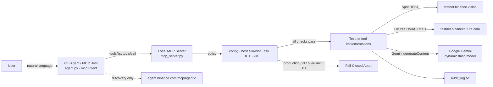

# SentinelOS

### Fail-Closed Risk-Defense Agent for Binance Agent OS (Track A)

**SentinelOS is built on Binance Agent OS & MCP (Model Context Protocol) architecture.** It is a conversational Testnet trading agent that observes Spot and USDⓈ-M Futures state, reasons over live market data with Google Gemini, and **refuses to execute anything irreversible unless a human types `Y`**. Production Binance hosts are unreachable by design.

> Track A alignment: **Security · Human-in-the-Loop · Fail-Closed guardrails.** Testnet-only. 10% portfolio cap and $1,000 notional ceiling. Emergency kill-switch. Append-only audit trail. No production API path exists in this repository.

[](https://developers.binance.com/en/docs/agent-native/overview)
[](https://agent.binance.com/mcp/agentic)
[](https://testnet.binance.vision)
[](#safety-contract)
[](#usage-guide)

---

## Why this is a Track A Agent OS submission

**Track A: Build an AI agent with Agent OS.** SentinelOS is not a script that fires orders. It is an Agent OS–native CLI whose policy layer sits **in front of** Binance.

| Official surface | How SentinelOS uses it |
| --- | --- |
| [Agent Native / MCP Overview](https://developers.binance.com/en/docs/agent-native/overview) | Architecture, discovery, and tool-routing model |
| [llms.txt](https://developers.binance.com/en/docs/llms.txt) / [llms-full.txt](https://developers.binance.com/en/docs/llms-full.txt) | Machine-readable API context for agent reasoning |
| [Official MCP endpoint](https://agent.binance.com/mcp/agentic) | Capability **discovery only** — never a bypass around local guardrails |
| Local MCP wrapper | [`mcp_server.py`](mcp_server.py) — official `mcp` SDK server for **all trade-related actions** |
| [Binance Skills Hub](https://github.com/binance/binance-skills-hub) | Skill format — [`skills/binance/SKILL.md`](skills/binance/SKILL.md) |
| [`binance-connector`](https://binance-connector.readthedocs.io/en/stable/getting_started.html) | Official Python Spot client, pinned to Testnet |
| HMAC USDⓈ-M REST | Futures Testnet client pinned to `https://testnet.binancefuture.com` |

Every utterance is routed locally: **intent → official MCP `tools/call` → Testnet tool**. The CLI is an MCP host (`mcp.Client`) talking to `mcp_server.py` (`sentinelos-testnet-mcp`). Standalone REST from the agent is forbidden. If the host, environment, size cap, kill-switch, or HITL check fails, the tool is never reached. Hosted MCP (`https://agent.binance.com/mcp/agentic`) is discovery-only.

---

## What judges should see in 60 seconds

```bash
python main.py
```

1. Startup banner states **Binance Agent OS & MCP**, then **Local MCP server ready** with `tools/list` names from `sentinelos-testnet-mcp`.
2. `futures balance` is `tools/call get_futures_testnet_balance` (read-only USDⓈ-M Testnet wallet).
3. `analyze BTCUSDT` fetches live Testnet tickers, then a Gemini reading from a **dynamically listed** flash model.
4. `futures buy BTCUSDT 0.001 --sl 58000 --tp 62000` previews first. **Only `Y` submits.** `N` / Enter / anything else is denial.
5. An oversized order prints **SECURITY WARNING** and is blocked even after `Y`.
6. `history` prints `audit_log.txt`. `kill` closes clients and shuts down.

---

## Core features

### 1. Futures Testnet trading (HITL)

USDⓈ-M Futures against `https://testnet.binancefuture.com` using `BINANCE_FUTURES_TESTNET_API_KEY` / `BINANCE_FUTURES_TESTNET_API_SECRET`.

```text
sentinel> futures balance
sentinel> futures buy BTCUSDT 0.001 --sl 58000 --tp 62000
Submit this Futures Testnet order? Type Y to confirm or N to abort [N]:
```

- HMAC-signed REST (no conflicting `binance` package overwrite of the Spot connector).
- HTTP follows **no redirects**, so a Testnet URL cannot bounce onto `fapi.binance.com`.
- Same fail-closed preview → `Y`/`N` → submit path as Spot.
- After a MARKET fill, reduce-only `STOP_MARKET` and `TAKE_PROFIT_MARKET` exits are placed.

### 2. Gemini AI market analysis

```text
sentinel> analyze BTCUSDT
```

- Pulls **live Testnet** last price and 24h ticker (Spot and Futures).
- Calls **Google Gemini** through the official `google-genai` SDK using `LLM_API_KEY`.
- **Dynamic model fetch:** `client.models.list()` → first catalog model whose name contains `flash` and that supports `generateContent`.
- If listing fails: `gemini-1.5-flash-latest`, then `gemini-1.5-flash-001`.
- Automatic function calling is **disabled**. Plain text in, text out. Analysis never places an order.

### 3. Stop-loss and take-profit (Spot + Futures)

Native `--sl` / `--tp` on both venues:

```text
buy BTCUSDT 0.001 --sl 58000 --tp 62000
futures sell ETHUSDT 0.01 --tp 2800 --sl 3500
```

- BUY: SL below last Testnet price, TP above.
- SELL: SL above last Testnet price, TP below.
- Invalid levels are rejected before HITL.
- Spot attaches OCO / STOP_LOSS / TAKE_PROFIT after the MARKET fill. Futures attaches reduce-only exits. A protection failure is reported and audited; the entry fill is not hidden.

### 4. Audit logger and trading history

Every preview, confirmation, rejection, API call, risk block, kill, and error is appended to `audit_log.txt` with a UTC timestamp. Secrets are never written.

```text
sentinel> history
sentinel> history 20
```

### 5. Position / size limits (loss ceiling)

Hardcoded in [`core/risk.py`](core/risk.py) — **not** overridable from `.env`:

| Guardrail | Value |
| --- | --- |
| Portfolio fraction | 10% of Testnet equity per trade |
| Hard notional ceiling | 1,000 USDT |
| Effective cap | **min(10%, $1,000)** |

Breach → `PermissionError` + **SECURITY WARNING**. No order is sent, even after `Y`. Notional is capped independently of Futures leverage so 20× cannot bypass the rule.

### 6. Emergency kill-switch

```text
sentinel> kill
```

Arms a process-wide latch, aborts pending tool work, closes Spot and Futures clients, writes `KILL_SWITCH` to the audit log, and shuts down. There is **no in-process resume**.

---

## Fail-closed security (Track A)

| Control | Enforcement |
| --- | --- |
| Testnet-only | `BINANCE_ENV` must equal `testnet`. Hosts outside `{testnet.binance.vision, testnet.binancefuture.com}` raise `RuntimeError: Blocked non-Testnet Binance host.` |
| Frozen config | Pydantic v2 frozen settings. Base URLs cannot be mutated after load. |
| Secrets | API keys are `SecretStr`. Never printed, never audited. |
| HITL | `human_confirmed=False` (default) is denial. Only an exact CLI `Y` sets `True`. |
| Dry-run first | Preview JSON must be `{ "environment": "testnet", "status": "order_preview" }` or submit is aborted. |
| Size cap | 10% and $1,000 checked at preview **and** submit. |
| Kill-switch | Every tool call checks the latch before talking to Binance. |
| No production fallback | Missing credentials, bad host, or connector fault **abort**. There is no retry against `api.binance.com` / `fapi.binance.com`. |

Policy sources: [`policies/testnet_only.py`](policies/testnet_only.py), [`policies/execution_guardrails.md`](policies/execution_guardrails.md), [`core/risk.py`](core/risk.py), [`core/kill_switch.py`](core/kill_switch.py).

---

## Architecture



| Layer | Path | Responsibility |
| --- | --- | --- |
| Entry | [`main.py`](main.py) | Agent OS / MCP startup banner, secure shutdown |
| CLI Agent | [`agent.py`](agent.py) | Intent router, Rich UI, HITL `Y`/`N` — MCP host only |
| MCP server | [`mcp_server.py`](mcp_server.py) | Official `mcp` SDK server (`sentinelos-testnet-mcp`) |
| MCP host | [`core/mcp_host.py`](core/mcp_host.py) | Official `mcp.Client` (`tools/list`, `tools/call`) |
| Config | [`core/config.py`](core/config.py) | Frozen Testnet URLs, secret keys, Gemini `auto` model |
| Policy | [`policies/`](policies/) + [`core/risk.py`](core/risk.py) + [`core/kill_switch.py`](core/kill_switch.py) | Host allowlist, 10% / $1,000, kill-switch |
| Audit | [`core/audit.py`](core/audit.py) | Timestamped append-only log |
| Skill | [`skills/binance/SKILL.md`](skills/binance/SKILL.md) | Agent OS instructions and MCP / llms.txt routing |
| Spot tools | [`tools/binance_testnet_tools.py`](tools/binance_testnet_tools.py) | `binance-connector` Spot Testnet + SL/TP (invoked only by MCP) |
| Futures tools | [`tools/binance_futures_testnet_tools.py`](tools/binance_futures_testnet_tools.py) | HMAC USDⓈ-M Futures Testnet + SL/TP (invoked only by MCP) |
| Analysis | [`tools/market_analysis.py`](tools/market_analysis.py) | Testnet tickers + Gemini (`google-genai`, dynamic flash) |

---

## Installation

Python 3.10+. From the repository root:

**Windows PowerShell**

```powershell
python -m venv .venv
.\.venv\Scripts\Activate.ps1
pip install -r requirements.txt
copy .env.example .env
```

**macOS / Linux**

```bash
python -m venv .venv
source .venv/bin/activate
pip install -r requirements.txt
cp .env.example .env
```

Dependencies: `binance-connector`, `pydantic>=2.0`, `pydantic-settings`, `python-dotenv`, `rich`, `aiohttp`, `httpx`, `google-genai`, `mcp[cli]>=2.0` (official Model Context Protocol SDK).

The CLI talks to the local MCP server. External MCP hosts (Claude Desktop, Inspector) can attach over stdio:

```bash
python mcp_server.py
```

Edit `.env`:

```env
BINANCE_ENV=testnet
BINANCE_SPOT_TESTNET_API_KEY=your_spot_testnet_key
BINANCE_SPOT_TESTNET_API_SECRET=your_spot_testnet_secret
BINANCE_FUTURES_TESTNET_API_KEY=your_futures_testnet_key
BINANCE_FUTURES_TESTNET_API_SECRET=your_futures_testnet_secret
LLM_API_KEY=your_google_gemini_api_key
LLM_MODEL=auto
```

`BINANCE_ENV` **must** remain `testnet`. Spot keys: [testnet.binance.vision](https://testnet.binance.vision/). Futures keys: [testnet.binancefuture.com](https://testnet.binancefuture.com/). Gemini key: [Google AI Studio](https://aistudio.google.com/). These are not production keys and must never be pointed at `api.binance.com` or `fapi.binance.com`.

---

## Usage guide

```bash
python main.py
```

Equivalent: `python agent.py`. Type `help` at any time.

| You type | What happens | Mutates Testnet funds |
| --- | --- | --- |
| `balance` | Spot Testnet snapshot | No |
| `futures balance` | USDⓈ-M Futures Testnet wallet | No |
| `analyze SYMBOL` | Live Testnet tickers + Gemini flash reading | No |
| `buy SYMBOL QTY [--sl P] [--tp P]` | Preview → **Y/N** → Spot MARKET + SL/TP | Only after `Y` |
| `sell SYMBOL QTY [--sl P] [--tp P]` | Preview → **Y/N** → Spot MARKET + SL/TP | Only after `Y` |
| `futures buy SYMBOL QTY [--sl P] [--tp P]` | Preview → **Y/N** → Futures MARKET + SL/TP | Only after `Y` |
| `futures sell SYMBOL QTY [--sl P] [--tp P]` | Preview → **Y/N** → Futures MARKET + SL/TP | Only after `Y` |
| `history [N]` | Latest audit events | No |
| `kill` | Abort, close connections, exit | No (halts) |
| `help` / `exit` | Help table / leave | No |

HITL prompt (default **N**):

```text
Submit this Futures Testnet order? Type Y to confirm or N to abort [N]:
```

Only an exact `Y` proceeds.

---

## Safety contract

| Rule | Failure mode |
| --- | --- |
| Testnet-only hosts | `RuntimeError("Blocked non-Testnet Binance host.")` |
| Fail-closed config | Boot abort; no production fallback |
| Human-in-the-loop | `PermissionError`; nothing sent |
| 10% / $1,000 cap | `PermissionError` + SECURITY WARNING |
| Dry-run first | Submit aborted if preview is not `order_preview` |
| Kill-switch | Clients closed; process exits |
| Audit trail | `audit_log.txt` |

SentinelOS operates strictly in Dry-Run / Testnet mode. All irreversible actions require explicit user confirmation. Maximum exposure: 10% of portfolio per trade **or** 1,000 USDT notional, whichever is smaller.

---

## Disclaimer

SentinelOS is an informational Testnet agent for the Binance Agent OS Hackathon. It does not constitute investment, financial, or trading advice and does not promote any asset. Digital asset prices are subject to high market risk and price volatility. You are solely responsible for evaluating information and for all trading decisions. See Binance [Risk Warning](https://www.binance.com/en/risk-warning) and [Terms of Use](https://www.binance.com/en/terms).
